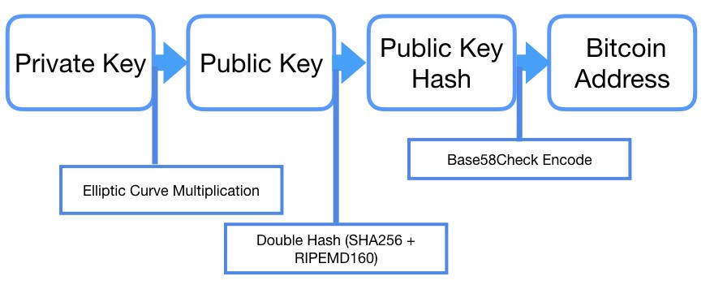

---
toc:
  sidebar: true
giscus_comments: true
layout: post
title: "MIT 15.S12 Blockchain and Money Note (Lec 3)"
date: "2021-06-06"
categories: 
  - "blockchain-technology"
  - "financialinvestment"
---

Study Question:

1. What are the design features - cryptography, append-only timestamped blocks, distributed consensus algorithms, and networking - of Bitcoin, the first use case of blockchain technology?
2. What are cryptographic hash functions, asymmetric cryptography and digital signatures? How are they utilised to help make blockchain verifiable and immutable?
3. What is double-spending problem and how it is addressed by blockchain technology?

**Design Feature**

- **Cryptographic Hash Functions**
    - Digital fingerprints for data
    - **Preimage resistant** (One way): infeasible to determine x from Hash(x)
    - **Collision resistant**: infeasible to find and x and y where Hash(x) = Hash(y)
    - **Avalanche effect**: Change x slightly and Hash(x) changes significantly
    - Puzzle friendliness: knowing Hash(x) and part of x it is still very hard to find rest of x

- **Timestamped Append-only Logs (Blocks)**

- **Block Headers & Merkle Trees**
    - The block header contains three sets of block metadata. It is an 80-byte long string, and it is comprised of the 4-byte long Bitcoin version number, 32-byte previous block hash, 32-byte long Merkle root, 4-byte long timestamp of the block, 4-byte long [difficulty](https://www.investopedia.com/terms/d/difficulty-cryptocurrencies.asp) target for the block, and the 4-byte long [nonce](https://www.investopedia.com/terms/n/nonce.asp) used by miners.
    - Nounce: Random number that could only be used once.
    - Merkel Trees: **Hash tree** or **Merkle tree** is a [tree](https://en.wikipedia.org/wiki/Tree_(data_structure)) in which every [leaf node](https://en.wikipedia.org/wiki/Leaf_node) is labelled with the [cryptographic hash](https://en.wikipedia.org/wiki/Cryptographic_hash_function) of a data block, and every non-leaf node is labelled with the cryptographic hash of the labels of its child nodes.

- **Asymmetric Cryptography & Digital Signatures**
    - Generate Key Pair - Public Key (PK) & Private Key (sk) - from random number
    - Signature – Creates Digital Signature (Sig) from message (m) and Private Key (sk)
    - Verification – Verifies if a signature (Sig) is valid for a message (m) and a Public Key (PK)
    - Properties: Infeasible to find Private Key (sk) from Public Key (PK)
    - Concept Intuition: **Private Key**, something personal and don't want people to know, it's for **decrypt** when someone send you encrypted message, and public key is for **encrypt or verify**, you could give it to others, when others send a message to you with public key encrypted, you could use your private key to decrypt. When you're trying to send email to someone possesses your public key, you could use hash function (content of email)-> digest, then use private key to encrypt **digest** to generate the digital signatures, when people get your data(e-mail or other), they use public key to verify this signature and use the same hash function to the decrypted message(digest), if its the same as the email means it was not changed after sending.

- **Bitcoin Digital Signature Function**
    - Elliptic Curve Digital Signature Algorithm (EDCSA) for generating private and public key pair

- **Addresses**
    - How bitcoin addresses are generated: [English Explanation](https://hackernoon.com/how-to-generate-bitcoin-addresses-technical-address-generation-explanation-rus3z9e), [Chinese Explanation](https://zhuanlan.zhihu.com/p/57448243).

